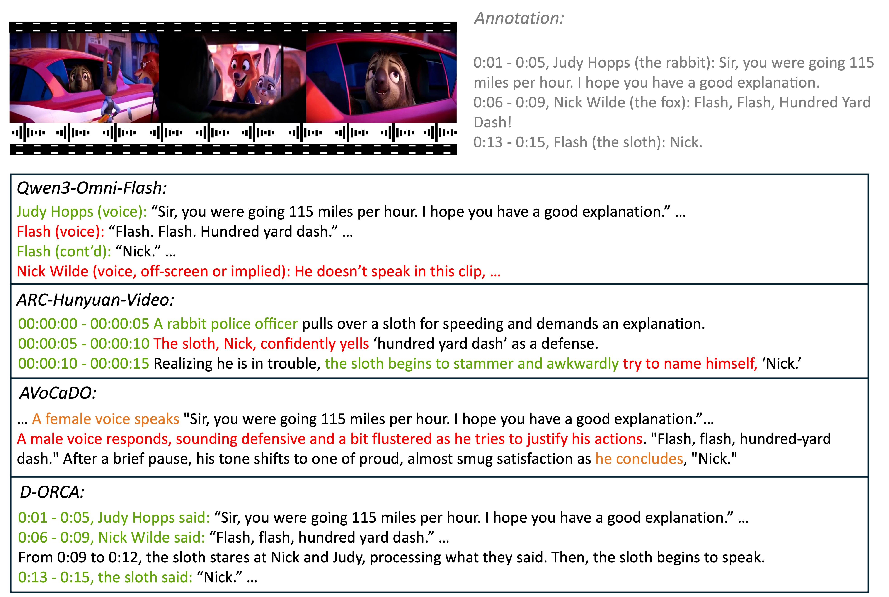

# D-ORCA: Dialogue-Centric Optimization for Robust Audio-Visual Captioning

<div align="center">

<!--  -->

**Resolving the Triplet of "When, Who, and What is Said" in Dialogue-Centric Videos**

<a href="https://arxiv.org/abs/2602.07960"></a>
<a href="https://huggingface.co/tsinghua-ee/D-ORCA-8B-0210"></a>
<a href="https://d-orca-llm.github.io/"></a>
<a href="https://github.com/WeChatCV/D-ORCA/blob/main/LICENSE"></a>

</div>

---

## 🔥 News
*   **[2026/02/10]** 🚀 **D-ORCA** inference code and the model checkpoint are released! We achieve SOTA results on dialogue-centric video understanding among open-sourced models.
*   **[2026/02/08]** 📄 Our paper is available on arXiv.

## 📖 Introduction

We introduce **D-ORCA**, a dialogue-centric omni-modal large language model optimized for robust audio-visual captioning. Unlike existing models that struggle with speaker attribution and temporal alignment, D-ORCA is designed to accurately resolve **when, who, and what is said** in the video.

Most open-source multimodal LLMs fail to produce accurate, dialogue-aware captions (see Figure 1). D-ORCA addresses this by:
1.  **Constructing DVD-Train**: A large-scale (40k videos) bilingual dataset tailored for dialogue scenarios.
2.  **Novel RL Optimization**: Adopting GRPO with three specialized rewards:
    *   🎯 **Speaker Attribution Accuracy**
    *   📝 **Global Speech Content Accuracy**
    *   ⏱️ **Sentence-level Temporal Boundary Alignment**

Despite having only **8B parameters**, D-ORCA outperforms existing open-source models and remains competitive with significantly larger models on general benchmarks.

<div align="center">
  
  <br>
  <em>Figure 1: Comparison of D-ORCA with other models. D-ORCA accurately identifies speakers, recognizes speech, and aligns timestamps.</em>
</div>

## 🏆 Performance

D-ORCA achieves state-of-the-art performance on our curated **DVD-Bench**.

| Model | (En) Acc% ↑ | (En) WER% ↓ |  (En) IoU% ↑ | (Zh) Acc% ↑ | (Zh) WER% ↓ | (Zh) IoU% ↑ |
| :--- | :---: | :---: | :---: | :---: | :---: | :---: |
| ARC-Qwen-Video-Narrator (7B) | 66.4 | 65.0 | 23.0 | 63.2 | 53.6 | 10.1 |
| Qwen2.5-Omni (7B) | 62.7 | 83.6 | - | 55.7 | 69.4 | - |
| video-SALMONN 2+ (7B) | 66.6 | 94.0 | - | 59.9 | - | - |
| AVoCaDO (7B) | 72.9 | 17.9 | - | 69.3 | - | - |
| Qwen3-Omni-Instruct (30B) | 67.8 | 91.3 | - | 63.5 | 60.6 | - |
| **D-ORCA (8B)** | **81.1** | **16.6** | **57.1** | **78.0** | **17.5** | **37.8** |

---

D-ORCA also achieves competitive results on general audio-visual benchmarks.


| Model | Video-MME | WorldSense | AVUT | Video-Holmes | DailyOmni | AV-SpeakerBench |
| :--- | :---: | :---: | :---: | :---: | :---: | :---: |
| OmniVinci (7B) | 68.6 | 48.2 | - | - | 66.5 | - |
| ARC-Qwen-Video-Narrator (7B) | 62.4 | 45.1 | - | 43.2 | 63.2 | 40.2 |
| Qwen2.5-Omni (7B) | 64.3 | 47.8 | 66.3 | 43.7 | 62.7 | 42.3 |
| video-SALMONN 2+ (7B) | **73.4** | 50.9 | 69.5 | 46.9 | 71.8 | 51.6 |
| AVoCaDO (7B) | 65.9 | 49.9 | 70.0 | 47.2 | 69.8 | 51.6 |
| Qwen3-Omni-Instruct (30B-A3B) | 70.5 | **54.0** | 72.0 | **54.1** | 69.8 | 54.1 |
| **D-ORCA (8B)** | 72.9 | 53.7 | **76.1** | 48.5 | **78.5** | **55.0** |

## 🛠️ Quick Start

### Model Zoo

| Model | Base LLM | Params | HuggingFace |
| :--- | :--- | :---: | :---: |
| **D-ORCA-8B-0210** | Qwen3-VL-8B | 8B | [Download](https://huggingface.co/tsinghua-ee/D-ORCA-8B-0210) |

### Installation

For key library versions, please refer to `new_req.txt`. Install via:
```bash
pip install -r new_req.txt
```

### Inference

For evaluation on a whole dataset:

1. Prepare the dataset following `scripts/example_sft.json`.
2. Modify the parameters in `scripts/direct_test.sh`.
3. Run `bash scripts/direct_test.sh`.

For setting up a CLI demo:
1. Modify the parameters in `scripts/direct_demo.sh`.
2. Run `bash scripts/direct_demo.sh`.
3. Modify `scripts/demo_config.yaml` to control input.

## 📅 Roadmap

- [x] Release D-ORCA 8B model checkpoints.
- [x] Release Inference Code.
- [ ] Release **DVD-Bench** evaluation data.
- [ ] Release Training Code (SFT, pre-DPO, GRPO).
- [ ] Release **DVD-Train** dataset annotations.

## 🖊️ Citation

If you find D-ORCA useful for your research, please cite our paper:

```bibtex
@article{tang2026dorca,
  title={{D-ORCA: Dialogue-Centric Optimization for Robust Audio-Visual Captioning}}, 
  author={Changli Tang and Tianyi Wang and Fengyun Rao and Jing LYU and Chao Zhang},
  journal={arXiv preprint arXiv:2602.07960},
  year={2026}
}
```

## 📄 License

This project is licensed under the [Apache 2.0 License](LICENSE).